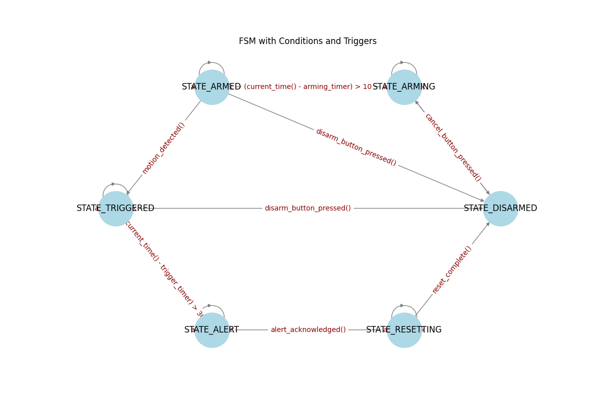

# Python FSM Extractor & Visualizer


The goal of this project is support debugging of Open Source projects written in Python
with creazy FSMs as visual graph representation tool.

This project provides a Python tool that extracts finite state machine (FSM) 
transitions from Python source code using the `ast` module, 
builds a directed graph using `networkx`, and visualizes it with `matplotlib`.


## Features

- Parses Python code to detect state transitions
- Supports custom "state" variable names
- Handles nested `if` conditions and logical expressions
- Builds a directed graph of FSM transitions
- Visualizes the FSM with labeled edges and triggers

## Dependencies

Make sure you have the following Python packages installed:

```bash
pip install networkx matplotlib
```

## Usage
Run the tool from the command line:

```bash
python main.py <target_python_file.py> [state_variable_name]
```
Where:
- target_python_file.py: The Python file containing FSM logic
- state_variable_name: Optional. Defaults to "state" if not provided

### Example

```bash
python3 main.py py_examples/fsm_test.3.py
```

### Output

Prints detected transitions in the format:

```bash
Detected Transitions:
STATE_DISARMED -> STATE_ARMING [arm_button_pressed()]
STATE_ARMING -> STATE_ARMING [active block]
STATE_ARMING -> STATE_DISARMED [cancel_button_pressed()]
STATE_ARMING -> STATE_ARMED [(current_time() - arming_timer) > 10]
STATE_ARMED -> STATE_ARMED [active block]
STATE_ARMED -> STATE_DISARMED [disarm_button_pressed()]
STATE_ARMED -> STATE_TRIGGERED [motion_detected()]
STATE_TRIGGERED -> STATE_TRIGGERED [active block]
STATE_TRIGGERED -> STATE_DISARMED [disarm_button_pressed()]
STATE_TRIGGERED -> STATE_ALERT [(current_time() - trigger_timer) > 30]
STATE_ALERT -> STATE_ALERT [active block]
STATE_ALERT -> STATE_RESETTING [alert_acknowledged()]
STATE_RESETTING -> STATE_RESETTING [active block]
STATE_RESETTING -> STATE_DISARMED [reset_complete()]

```

Opens a visual graph window showing:
- Nodes as states
- Directed edges as transitions
- Labels as trigger conditions


## Sample FSM Code in Python language

```python
state = "STATE_DISARMED"
arming_timer = 0
trigger_timer = 0

def arm_button_pressed():
  pass

if state == "STATE_DISARMED" and arm_button_pressed():
    state = "STATE_ARMING"
    arming_timer = current_time()

elif state == "STATE_ARMING":
    if cancel_button_pressed():
        state = "STATE_DISARMED"
    elif current_time() - arming_timer > 10:
        state = "STATE_ARMED"

elif state == "STATE_ARMED":
    if disarm_button_pressed():
        state = "STATE_DISARMED"
    elif motion_detected():
        state = "STATE_TRIGGERED"
        trigger_timer = current_time()

elif state == "STATE_TRIGGERED":
    if disarm_button_pressed():
        state = "STATE_DISARMED"
    elif current_time() - trigger_timer > 30:
        state = "STATE_ALERT"

elif state == "STATE_ALERT":
    if alert_acknowledged():
        state = "STATE_RESETTING"

elif state == "STATE_RESETTING":
    if reset_complete():
        state = "STATE_DISARMED"
```

## Output Image with graph represention for below exmple Python code



